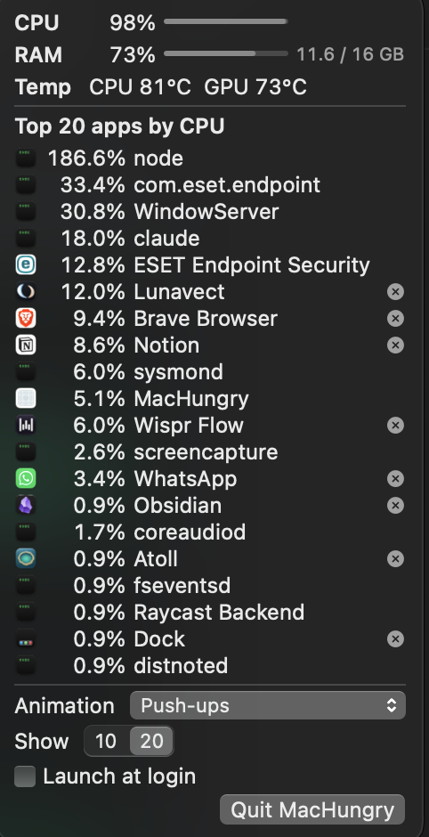

# MacHungry

A small macOS menu bar app that shows how "hungry" your Mac is.
It shows live CPU %, RAM %, and CPU temperature. A small animation runs faster when the CPU works harder.


Click the item to see the top apps by CPU:

<p align="center">
  
</p>

## Features

- **Menu bar values**: CPU % (`C`), RAM % (`R`), and CPU temperature (`68°`). The values update every second.
- **Animation**: the speed follows CPU %. There are 3 themes: Cat, Push-ups, and Pull-ups.
- **Custom layout**: right-click the item to show, hide, or move each part. The app keeps your layout after a restart.
- **Top apps popover**: the top 10 or 20 apps by CPU %, for all users. Helper processes add into their parent app.
- **Quit an app**: each row has a quit button. The app asks first and sends a normal quit (never a force quit).
- **Temperature**: CPU and GPU °C on Apple Silicon. On a Mac with no known sensors, the app hides the temperature. It never shows a guess.
- **Launch at login**: a toggle in the popover.
- **Light and dark mode**, no Dock icon, universal binary (Apple Silicon and Intel).

## Resource budget

A monitor app must not load the Mac that it monitors.

| State | Limit |
|---|---|
| RAM (physical footprint), before the first popover open | < 30 MB |
| RAM, after the first popover open (SwiftUI caches stay loaded) | < 35 MB |
| CPU, popover closed | < 1% of 1 core |
| CPU, popover open | < 5% of 1 core |

The app reads the process list only while the popover is open. A hidden part runs no timer and does no sensor read.

## Requirements

- macOS 14 (Sonoma) or later
- Xcode Command Line Tools (`xcode-select --install`). Full Xcode is not necessary.
- Swift 6

## Build and run

```bash
swift build
scripts/test.sh
scripts/make-app.sh
open build/MacHungry.app
```

| Task | Command |
|---|---|
| Debug build | `swift build` |
| Tests | `scripts/test.sh` |
| `.app` bundle + DMG (ad-hoc signed) | `scripts/make-app.sh` |
| Signed + notarized DMG | `scripts/make-app.sh --identity "Developer ID Application: ..."` |

> Use `scripts/test.sh`, not `swift test`. The Command Line Tools need an extra plugin path for Swift Testing, and the script adds it.

`make-app.sh` builds for `arm64` and `x86_64`, joins them with `lipo`, signs the bundle, and writes `build/MacHungry.app` and `build/MacHungry.dmg`. For notarization, store a keychain profile first with `xcrun notarytool store-credentials machungry-notary`.

## Architecture

The code has 3 modules. Each module has 1 job.

| Module | Kind | Job | Imports |
|---|---|---|---|
| `HungryCore` | library | Pure logic: calculations, parsers, ranking, themes. | `Foundation` only |
| `HungrySystem` | library | Samplers that call Mach, `libproc`, `/bin/ps`, and the SMC (IOKit). | `HungryCore`, system frameworks |
| `MacHungry` | executable | AppKit + SwiftUI: menu bar item, popover, preferences. | all |

```
            ┌──────── HungrySystem (background actor) ─────────┐
 timer 1s → │ SystemSampler      → CPU %, RAM %                │
 timer 2s → │ TemperatureSampler → SMC → CPU / GPU °C          │
 timer 1s → │ ProcessSampler     → ps → per-PID CPU → grouper  │
 (popover   │                                                   │
  open only)└──────────────────────┬────────────────────────────┘
                                   ▼
                    StatsMonitor → StatsStore (@MainActor, @Observable)
                     ┌─────────────┴──────────────┐
                     ▼                            ▼
          StatusItemController             PopoverView (SwiftUI)
          ├ StatusContentView (layers)     ├ PopoverModel
          ├ MenuBarAnimator                ├ Top N rows + icons
          │   └ AnimationTheme             ├ Quit row → AppTerminator
          └ SegmentMenu (right-click)      └ Toggle → LoginItemManager
```

All unit tests target `HungryCore`, because it has no system calls. The `HungrySystem` tests are integration tests that read the real machine.

## Project structure

```
Sources/
├── HungryCore/            pure logic, unit tested
│   ├── Metrics/           CPU %, RAM %, speed curve, text format
│   ├── Processes/         ps parser, per-PID CPU, app grouping, stable ranking
│   ├── Temperature/       chip detection, SMC sensor tables
│   ├── StatusBar/         menu bar parts, labels, layout settings
│   └── Themes/            animation themes and the theme registry
├── HungrySystem/          calls into the operating system
│   ├── Readers/           libproc, /bin/ps, SMC
│   └── Samplers/          system, process, and temperature samplers + engine
└── MacHungry/             the app
    ├── App/               entry point, app delegate, login item, app quit
    ├── StatusBar/         menu bar item, animator, image composer, right-click menu
    ├── Popover/           SwiftUI popover and its rows
    ├── Stats/             sampling monitor and observable store
    └── Preferences/       layout, theme, and top-apps settings
Tests/
├── HungryCoreTests/       unit tests (Swift Testing)
└── HungrySystemTests/     integration tests
Resources/
├── Info.plist
└── Themes/<theme-id>/frame-N.png, frame-N@2x.png
scripts/
├── test.sh                runs the tests with the correct plugin path
├── make-app.sh            builds the universal .app and the DMG
└── draw-frames.swift      draws the animation frames
docs/superpowers/          design spec and implementation plan
```

## Add an animation theme

1. Add the frames to `Resources/Themes/<id>/`. Each frame is 20 pt high, black on a transparent background, with a `@2x` version.
2. Create `Sources/HungryCore/Themes/<Name>Theme.swift` that conforms to `AnimationTheme`. Use `CatTheme.swift` as the model.
3. Add the theme to `ThemeRegistry.all`.
4. Add a test in `Tests/HungryCoreTests/` and run `scripts/test.sh`.

## Design spec

The source of truth is [`docs/superpowers/specs/2026-10-02-mac-hungry-menubar-design.md`](docs/superpowers/specs/2026-10-02-mac-hungry-menubar-design.md). Requirement ids (F1–F20, N1–N8) come from it.
